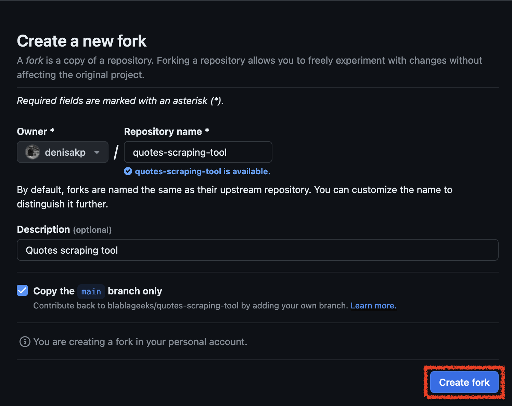
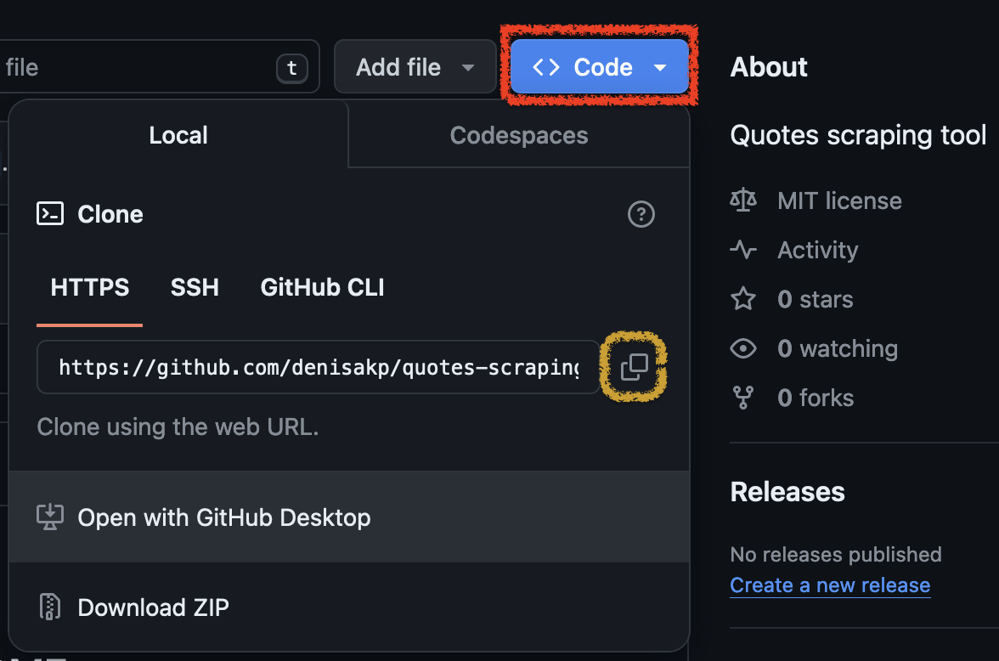
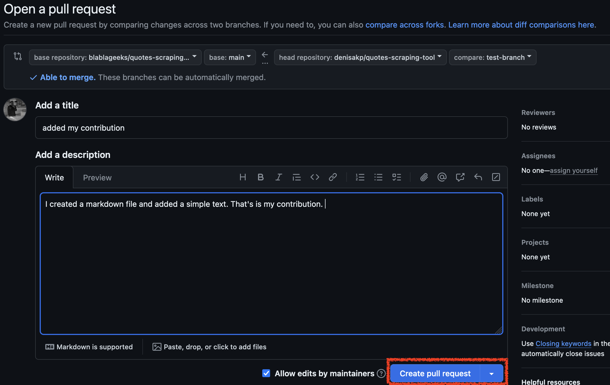

# Contributing to Quote Scraping Tool (SQT) project

Welcome to Quotes Scraping Tool (QST) project! We appreciate your interest in contributing to our open-source project.
Your contributions help make our project better and more inclusive. Before you get started, please take a moment to
review our contribution guidelines.

## Types of Contributions We Welcome

- **Bug Fixes**: Help us identify and fix issues in the project.
- **New Features**: Contribute new features and enhancements to improve the project.
- **Documentation**: Improve project documentation, README files, or provide examples.
- **Bug Reports**: Report any issues, errors, or bugs you encounter.
- **Feedback**: Share your feedback, ideas, or suggestions for improvement.
- **Testing**: Help us test the project, identify edge cases, and ensure its reliability.
- **Code Reviews**: Review pull requests, provide feedback, and help maintain code quality.

## How to contribute

To contribute to (QST) project, follow these steps:

### Fork the repository to your GitHub account

Fork this repository by clicking on the fork button on the top of this page.
 

Then click on **Create fork** button to create a copy of this repository in your GitHub account.


If everything went smoothy, you must have this exact screen


### Clone the repository

Now that we've successfully forked the repository and copied it into our account, we'll clone it, which essentially
creates a local copy of the project on your system. To clone a project locally, click the code button (red) followed by
the clipboard icon button (yellow). This step copies the repository link, which will be used to clone the project
locally.



Now clone the forked repository into your system. Navigate to your GitHub account, open the forked repository, click
the code button, and then choose the copy to clipboard icon.

Now, open your terminal and run the following git command:
```shell
git clone `the-url-` # just paste using Ctrl+v to paste the url
# for example: git clone https://github.com/denisakp/quotes-scraping-tool.git
```

Then you move into the project directory  by running:
```shell
cd your-project-name 
# for example: cd quotes-scraping-tool
```

### Create a Git branch for your contribution

To create a git branch, run the following branch (make sure you run the previous command, and you're inside the project
folder):
```shell
git checkout -b your-branch-name
```

### Make the necessary changes and commit your changes

Please refer to the [Getting started](README.md#getting-started) section in the readme file to prepare the project for
use. Through your preferred code editor, add the wanted changes. As we mention it earlier it in 
[this section](#types-of-contributions-we-welcome) there are multiple ways to contribute to this project.

After you've applied your changes, run `git status` command in your terminal to see which files have changed:
```shell
git status
```

Then add those changes to the branch you created earlier by running `git add ` command:
```shell
git add .
```
> This command will stage changes for the next commit

Now commit those changes using the `git commit` command:
```shell
git commit -m "added new feature"
# The commit message shown here is an example. You should include an informative statement that describes what your feature is about.
```

### Publish your changes to GitHub

Now let's publish your changes using the `git push` command:
```shell
git push -u origin your-branch-name
```
> Replace your-branch-name with the name of the branch you created earlier

### Submit your branch for review: create a Pull Request

If you go to your repository on GitHub, you'll see a screen like this:


Click on `Compare & pull request` button (framed in red)  and you will see the following screen:


> Your changes can only be added once your pull request have been reviewed and merged only then would you be able to
see you work on the main branch!

🎉 HOURAAA !!! All Done, Thank you mate for your time and effort ! 👏


We'll soon merge your contribution into the main branch of this project. You will receive a notification after
the modifications have been integrated.

## Pull Request Guidelines

When creating a pull request, please follow these guidelines:

- Provide a clear and concise description of your changes.
- Reference any relevant issues or related pull requests.
- Ensure your code is well-documented and includes inline comments where necessary.
- Test your changes thoroughly and provide evidence of successful testing.
- Be responsive to any feedback or comments on your pull request.

## Code of Conduct

We enforce a Code of Conduct to ensure a welcoming and inclusive environment for all contributors. Please review our
[Code of Conduct](CODE_OF_CONDUCT.md) to understand our community standards.

## Our Commitment

Our project maintainers are committed to responding promptly to issues, pull requests, and inquiries from contributors.
We appreciate your time and effort in making this project better.

Thank you for contributing to (QST) project!

## Attribution

We would like to acknowledge and thank all our contributors for their valuable contributions to this project.
Your dedication and support are greatly appreciated.
